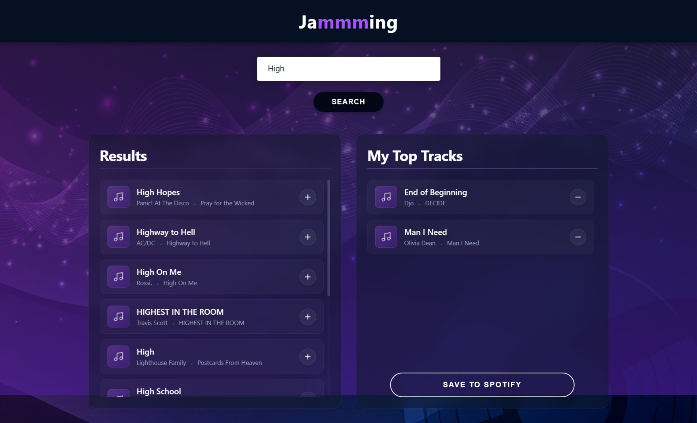

# Jammming

Jammming is a React web application that connects to the Spotify API, allowing users to search for songs, create custom playlists, and save them directly to their Spotify account. [Live Demo](https://devforgely.github.io/jammming)

## Features

- Spotify Login: First-time users are prompted to log in or create a Spotify account when searching for songs.

- Save Playlist to Account: Export custom playlists directly to the user's Spotify library with one click.

- Search by Song, Album, or Artist: Query Spotify's extensive music database using the search bar.

- Populate Results List: View returned tracks from search queries in an organized display.

- Add Songs to Custom Playlist: Use the + button on any track to add it to your playlist.

- Remove Songs from Custom Playlist: Use the - button to remove tracks from your playlist.

- Change Playlist Title: Edit and customize your playlist name.

## Technologies

- React: Front-end library for building component-based user interfaces

- Spotify Web API: Integration with Spotify's music database and user account features

- JavaScript (ES6+): Modern JavaScript for application logic and functionality

- HTML5 & CSS3: Structure and styling for the user interface

- HTTP Requests: Fetch API for communicating with Spotify endpoints

- Git & GitHub: Version control and project management

## Future improvements

- Track preview playback

- Drag‑and‑drop playlist reordering

- Smart recommendations based on current playlist

- Multi‑playlist creation and management

- Collaborative playlist sharing and editing